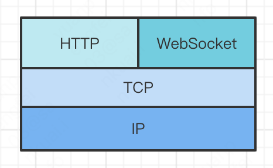
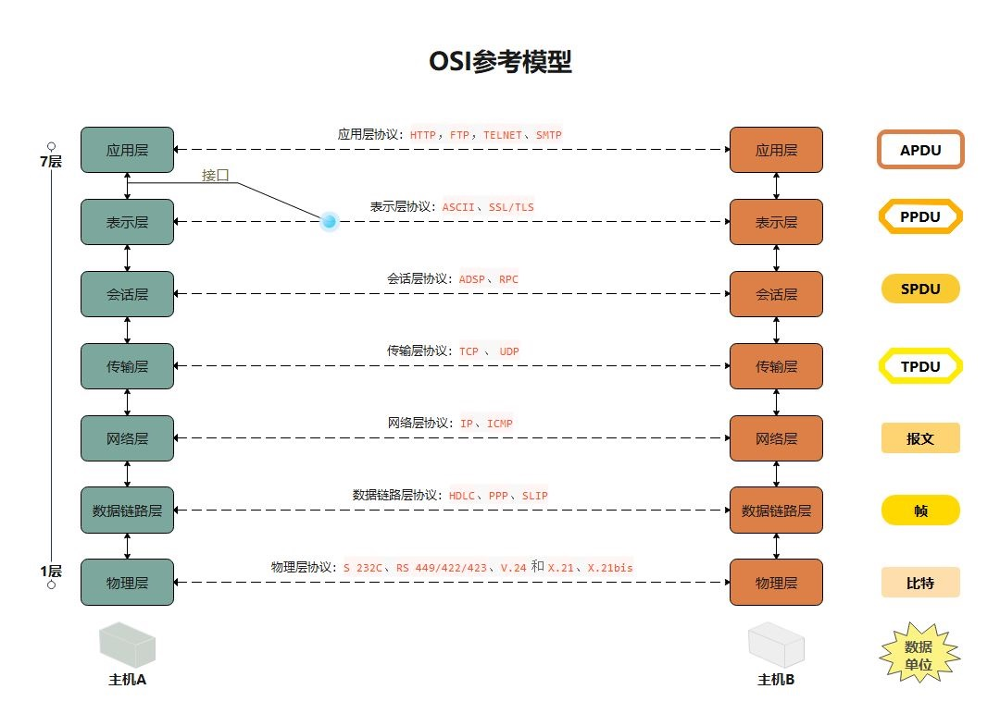
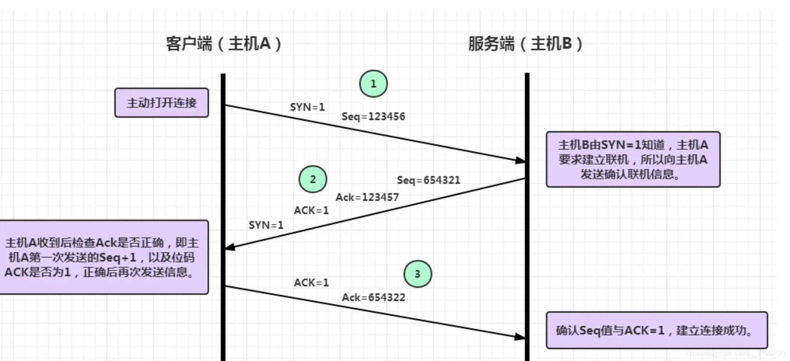
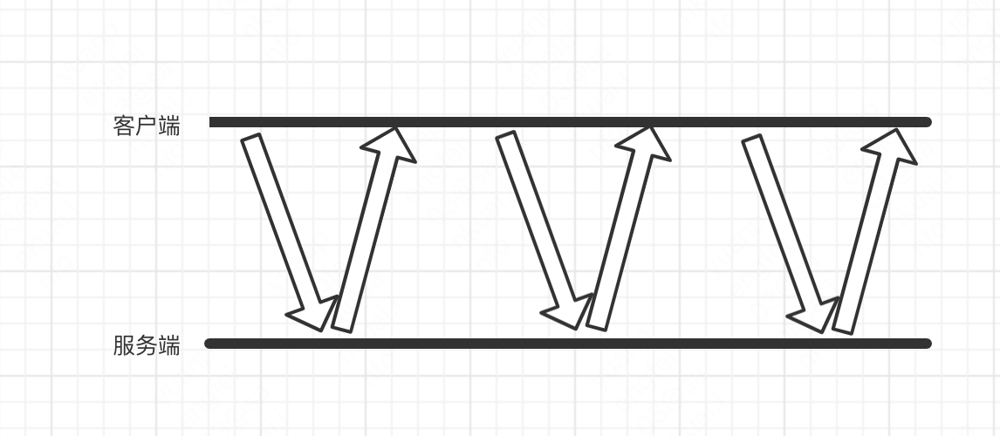
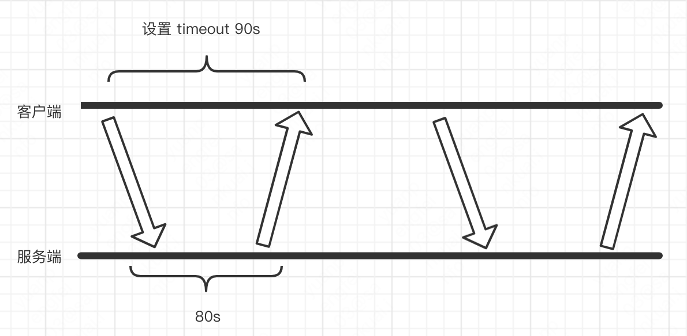

# WebSocket 实现热更新

## WebSocket

### 是什么

-   HTML5 下一种基于 TCP 的新协议
-   浏览器与服务器全双工通信
-   持久化的协议

### 原理

> HTTP 协议是无状态的，短连接/长连接

约定通信规范，通过握手机制，客户端于服务端建立 TCP 连接

### 与 HTTP 的关系

#### 相同点

-   基于 TCP，可靠性传输
-   应用层协议

#### 不同点

-   WebSocket 是双向通信协议，模拟 Socket 协议，可以双向发送和接收信息，HTTP 是单向的
-   WebSocket 需要浏览器和服务器端握手建立连接，HTTP 是浏览器单方面向服务器发起连接，服务器预先不知道这个连接

#### 联系

WebSocket 在建立握手的时候数据还是通过 HTTP 协议传输的，但是连接建立后的传输不再是 HTTP 协议。

#### 总结

1. 客户端发起请求，3 次握手，建立 TCP 连接
2. 服务端收到客户端的握手请求，采用 HTTP 协议返回数据
3. 客户端收到连接成功的消息后，借助 TCP 全双工信道，传输信息

### WebSocket 解决什么问题

#### HTTP 协议的问题

-   无状态，每次会话完成，不知道下一次的客户端是谁
-   效率低，携带 header 里大量信息，解析耗时
-   被动型，无法主动向客户端推送消息

#### 长轮询

1. 短轮询

2. 长轮询

-   推送延迟，数据发生变更，长轮询结束，立刻返回响应给客户端
-   服务压力，时间间隔较长，hold 请求不会占用过多服务端资源

#### Ajax 定时轮询

-   推送延迟
-   服务端压力大
-   推送延迟和服务端压力无法中和。
    -   降低轮询的间隔，延迟降低，压力增加；
    -   增加轮询的间隔，压力降低，延迟增高
